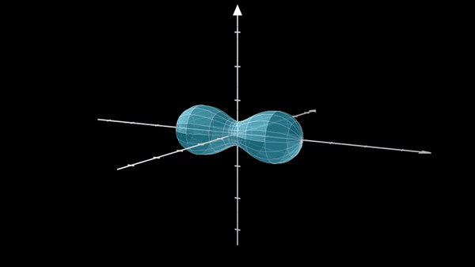

## Hibridación de orbitales hecho en Manim.

<p align="center">
  
</p>

### Autores:
Daniel Germán Martínez Muñoz  (Usuario github: dmartinezmu).

Leonardo Felipe Betancur Díaz


Producción audiovisual e ilustrativa de hibridación de orbitales.
Los requisitos y la guía para instalar manim se encuentran en:  [Manim 3b1b](https://github.com/3b1b/manim)


<p align="center">
	El video FINAL con voz y edición es este [RESULTADO FINAL] #Video final link#
</p>

### Aplicaciones usadas:
Adobe Illustrator CC -> Ilustraciones realizadas.

Adobe Premiere Pro   -> Edición video.

Adobe Audition       -> Edición audio.

Sony Vegas           -> Edición video.
 
MATLAB -> Gráficas      

### Fuentes de interés y agradecimientos:

Para los 3D Plots:[Theorem of Beethoven](https://github.com/Elteoremadebeethoven/AnimationsWithManim/blob/master/English/6b_plots_3D/scenes.md#programs)

Para las gráficas 2D: [Talking Physics](https://talkingphysics.wordpress.com/2018/06/22/graphing-functions-manim-series-part-7/)

Documentación: [Manim](https://manim.readthedocs.io/en/latest/)

Gráficas MATLAB : Evan (2020). plot Hydrogen Atom Molecular Orbital [link](https://www.mathworks.com/matlabcentral/fileexchange/44604-plot-hydrogen-atom-molecular-orbital), MATLAB Central File Exchange. Retrieved June 23, 2020.

## Agradecimiento especial:

Para el óvalo de cassini al usuario del level 314: [level 314 youtube channel](https://www.youtube.com/watch?v=zReqQ8NMsI0)

### Módulos y librerías necesarios:
```python
		
#!/usr/bin/env python
from big_ol_pile_of_manim_imports import *
import math
```

Además del conocimiento del lenguaje python, es necesario conocer latex.
## Escenas 
```python
class IntroErwin(Scene):

    def construct(self):
        title = TextMobject("Erwin", "Schrodinger")
        text = TexMobject(r"\Psi (r,\theta ,\phi )= ", "R(r)", "P(\\theta)", "F(\phi)")
        text_2 = TextMobject("Funcion de probabilidad")
        text_3 =TexMobject(r"\Psi^{2}")
        image = ImageMobject("note")
        title.next_to(image, UP, buff=0.3)
        title[1].set_color(GREEN)
        transform_title = TextMobject("Ecuacion de Schrodinger")
        transform_title.to_corner(UP + LEFT)
        transform_text = TexMobject(r"\Psi _{nlm}(r,\theta,\varphi)=\sqrt{(\frac{2}{na_{0}})^{3}\tfrac{(n-l-1)!}{2n(n+l)!}}e^{\frac{-\rho}{2}}\rho^{l}L_{n-l-1}^{2l+1}(\rho )Y_{lm}(\theta ,\rho)")
        text_2.next_to(transform_text,DOWN, buff=0.3)
        text_3.next_to(transform_text,DOWN,buff=1.5)
        self.play(
            Write(title),
            FadeInFrom(image, UP),
        )

        self.wait(3)

        self.play(
            LaggedStart(FadeOutAndShiftDown, image)
        )

        self.wait()

        self.play(
            Transform(title, transform_title),
            Write(text)
        )
        self.wait(2)

        self.play(
            Transform(text, transform_text),
            Write(text_2),
            ShowCreation(text_3)
        )

        self.wait(5)

        self.play(
            LaggedStart(FadeOutAndShiftDown, transform_title),
            LaggedStart(FadeOutAndShiftDown, transform_text),
            LaggedStart(FadeOutAndShiftDown, text_2),
            LaggedStart(FadeOutAndShiftDown,title),
            LaggedStart(FadeOutAndShiftDown,text),
            LaggedStart(FadeOutAndShiftDown, text_3),
        )
        self.wait(2)
```
El resultado es este: 


-


```python
class IntroEcuation(Scene):

    def construct(self):

        text = TexMobject(r"\Psi (r,\theta ,\phi )= ", "R(r)", "P(\\theta)", "F(\phi)")
        framebox1 = SurroundingRectangle(text[1], buff=.1)
        framebox2 = SurroundingRectangle(text[2], buff=.1)
        framebox3 = SurroundingRectangle(text[3], buff=.1)
        t1 = TexMobject("n")
        t2 = TexMobject("l")
        t3 = TexMobject("ml")
        t1.next_to(framebox1, UP, buff=0.1)
        t2.next_to(framebox2, UP, buff=0.1)
        t3.next_to(framebox3, UP, buff=0.1)
        text.set_color(BLUE)

        self.play(
            Write(text),
        )

        self.wait(2)

        self.play(
            ShowCreation(framebox1),
            FadeIn(t1)
        )

        self.wait(3)

        self.play(
            ReplacementTransform(framebox1.copy(), framebox2),
            ReplacementTransform(t1.copy(), t2),
        )

        self.wait(3)

        self.play(
            ReplacementTransform(framebox2.copy(), framebox3),
            ReplacementTransform(t2.copy(), t3),
        )

        self.wait(6)

        self.play(
            LaggedStart(FadeOutAndShiftDown, text),
            LaggedStart(FadeOutAndShiftDown, framebox1),
            LaggedStart(FadeOutAndShiftDown, framebox2),
            LaggedStart(FadeOutAndShiftDown, framebox3),
            LaggedStart(FadeOutAndShiftDown, t1),
            LaggedStart(FadeOutAndShiftDown, t2),
            LaggedStart(FadeOutAndShiftDown, t3),
        )
        self.wait(2)

```

El resultado es este:

-

```python
class PlotOrbitalS(ThreeDScene):

    def construct(self):
        axes = ThreeDAxes()
        text3d = TextMobject("Orbital S en el hidrogeno")

        self.add_fixed_in_frame_mobjects(text3d)  # <----- Add this
        text3d.to_corner(UL)

        sphere = ParametricSurface(
            lambda u, v: np.array([
                1.5 * np.cos(u) * np.cos(v),
                1.5 * np.cos(u) * np.sin(v),
                1.5 * np.sin(u)
            ]), v_min=0, v_max=TAU, u_min=-PI / 2, u_max=PI / 2, checkerboard_colors=[BLUE_E, BLUE_E],
            resolution=(15, 32)).scale(1)

        self.set_camera_orientation(phi=75 * DEGREES)
        self.begin_ambient_camera_rotation(rate=0.2)

        self.add(axes)
        self.play(LaggedStart(ShowCreation, sphere), ShowCreation(axes), ShowCreation(text3d))

        self.wait(10)

        self.play (LaggedStart(FadeOutAndShiftDown, sphere),
                    LaggedStart(FadeOutAndShiftDown, axes),
                    LaggedStart(FadeOutAndShiftDown, text3d)
                    )
```
El resultado es este: 

-


```python
class PlotOrbitalP(ThreeDScene):

    def construct(self):

        axes = ThreeDAxes()
        text3d = TexMobject(r"P_{x}")
        text3d_2 = TexMobject(r"P_{z}")
        dot = Dot()
        self.add(dot)
        self.add_fixed_in_frame_mobjects(text3d)
        self.add_fixed_in_frame_mobjects(text3d_2)# <----- Add this
        text3d.to_corner(UL)
        text3d_2.to_corner(UL)

        sphere = ParametricSurface(
            lambda u, v: np.array([
                1.5 * np.cos(u) * np.cos(v),
                1.5 * np.cos(u) * np.sin(v),
                1.5 * np.sin(u)
            ]), v_min=0, v_max=TAU, u_min=-PI / 2, u_max=PI / 2, checkerboard_colors=[RED_E, RED_E],
            resolution=(15, 32)).scale(1)
        sphere.next_to(dot, RIGHT,buff=-0.1)

        sphere_2 = ParametricSurface(
            lambda u, v: np.array([
                1.5 * np.cos(u) * np.cos(v),
                1.5 * np.cos(u) * np.sin(v),
                1.5 * np.sin(u)
            ]), v_min=0, v_max=TAU, u_min=-PI / 2, u_max=PI / 2, checkerboard_colors=[RED_E, RED_E],
            resolution=(15, 32)).scale(1)
        sphere_2.next_to(dot,LEFT,buff=-0.1)

        self.set_camera_orientation(phi=75 * DEGREES)
        self.begin_ambient_camera_rotation(rate=0.2)

        self.add(axes)
        self.play(LaggedStart(ShowCreation, sphere),
                  LaggedStart(ShowCreation, sphere_2),
                  ShowCreation(axes),
                  ShowCreation(text3d)
                  )

        self.wait(5)

        self.play(
            ReplacementTransform(text3d, text3d_2),
        )
        self.play(LaggedStart(FadeOutAndShiftDown, sphere),
                  LaggedStart(FadeOutAndShiftDown, sphere_2),)

        vector = np.array([0,0,1])
        vector_2 = np.array([0, 0, -1])
        sphere.move_to(dot,vector)
        sphere_2.move_to(dot,vector_2)

        self.play(LaggedStart(ShowCreation, sphere),
                  LaggedStart(ShowCreation, sphere_2),
                  )

        self.wait(5)

        self.play (LaggedStart(FadeOutAndShiftDown, sphere),
                   LaggedStart(FadeOutAndShiftDown, sphere_2),
                   LaggedStart(FadeOutAndShiftDown, dot),
                    LaggedStart(FadeOutAndShiftDown, axes),
                    LaggedStart(FadeOutAndShiftDown, text3d)
                    )


```
El resultado es este:

-

```python
class PlotWave(GraphScene):
    CONFIG = {
        "x_min": -10,
        "x_max": 10,
        "y_min": -1,
        "y_max": 1,
        "y_axis_label": " ",
        "x_axis_label": " ",
        "graph_origin": ORIGIN,
        "function_color": RED,
        "axes_color": BLACK,
        "include_ticks": False
    }
    def construct(self):

        self.setup_axes(animate=True)
        func_graph = self.get_graph(self.func_to_graph, self.function_color)
        func_graph2 = self.get_graph(self.func_to_graph2,self.function_color)

        n_1 = TexMobject(r"n = 1")
        n_1.next_to(func_graph, RIGHT + UP)
        n_2 = TexMobject(r"n = 3")
        n_2.next_to(func_graph2, RIGHT + UP)
        wave_func = TexMobject(r"\Psi _{nlm}(r,\theta,\varphi)")
        text_1 = TexMobject(r"\Psi _{nlm}(2,0,0)")
        text_2 = TexMobject(r"\Psi _{nlm}(2,1,0)")
        text_3 = TexMobject(r"\Psi _{nlm}(2,1,1)")
        image_1 = ImageMobject("HW_1")
        image_2 = ImageMobject("HW_2")
        image_3 = ImageMobject("HW_3")
        image_1.to_edge(UP,buff=4)
        image_2.next_to(image_1, LEFT, buff=1.5)
        image_3.next_to(image_1, RIGHT, buff=1.5)

        self.play(ShowCreation(func_graph2), lag_ratio=0.1)
        self.play(ShowCreation(n_1))
        self.wait(5)

        self.play(
            LaggedStart(FadeOutAndShiftDown, func_graph2),
            LaggedStart(FadeOutAndShiftDown, n_1),
        )

        self.play(ShowCreation(func_graph), ShowCreation(func_graph2), lag_ratio=0.1)
        self.play(ShowCreation(n_2))
        self.wait(5)

        self.play(
            LaggedStart(FadeOutAndShiftDown, func_graph),
            LaggedStart(FadeOutAndShiftDown, func_graph2),
            LaggedStart(FadeOutAndShiftDown, n_2),
        )
        self.wait(2)
        wave_func.to_edge(UP, buff=1.5)
        text_1.to_edge(UP, buff=1.5)
        text_2.to_edge(UP, buff=1.5)
        text_3.to_edge(UP, buff=1.5)
        self.play(
            Write(wave_func),
        )

        self.wait(2)

        self.play(
            ReplacementTransform(wave_func, text_1),
            FadeInFrom(image_1, UP),)

        self.wait(2)

        self.play(
            ReplacementTransform(text_1, text_2),
            ReplacementTransform(image_1.copy(),image_2)
        	)

        self.wait(2)

        self.play(
            ReplacementTransform(text_2, text_3),
            ReplacementTransform(image_2.copy(),image_3)
        	)

        self.wait(5)

    def func_to_graph(self, x):
        return -(np.sin(x/2))

    def func_to_graph2(self, x):
        return np.sin(x/2)

```
El resultado es este :

-

```python
class Lemniscata (ThreeDScene):

    def construct(self):

        axes = ThreeDAxes()
        text3d = TexMobject(r"P_{x}")
        text3d.to_corner(UL)

        lemniscata = ParametricFunction(
            lambda u: np.array([
                2*(np.cos(u))/(1+np.sin(u)**2),
                0,
                2*(np.sin(u)*np.cos(u))/(1+np.sin(u)**2),
            ]),color=RED,t_min=-TAU,t_max=TAU)

        self.add(axes)
        lemniscata.set_shade_in_3d(True)
        self.add_fixed_in_frame_mobjects(text3d)
        self.set_camera_orientation(phi=80 * DEGREES,theta=-60*DEGREES)
        self.begin_ambient_camera_rotation(rate=0.3)

        self.play(
            ShowCreation(axes),
            ShowCreation(lemniscata),
            ShowCreation(text3d)
        )
        self.wait(10)


```

El resultado es este:

-

```python

class MainIntro(Scene):

    def construct(self):

        title = TextMobject("ORBITALES")
        text_1 = TexMobject(r"S")
        text_2 = TexMobject(r"P")
        line = Line(ORIGIN, RIGHT * FRAME_WIDTH, buff=1)

        line.move_to(ORIGIN)
        title.next_to(line,UP)
        text_1.next_to(line,RIGHT)
        text_2.next_to(line,LEFT)
        title.set_color(YELLOW)
        text_1.set_color(GREEN)
        text_2.set_color(BLUE)

        self.play(
            ShowCreation(line),
            FadeInFromDown(title)
        )

        self.wait(5)

        self.play(
            FadeOut(line),
            FadeOut(title)
        )

        self.wait()

        text_1.to_corner(UP + LEFT,buff=2)
        text_2.to_corner(UP + RIGHT,buff=2)

        self.play(
            DrawBorderThenFill(text_1),
            DrawBorderThenFill(text_2),
        )

        self.wait(10)

```

El resultado es este:

-

```python
class Hibridation(Scene):

    def construct(self):

        title = TextMobject("HIBRIDACION")
        text_1 = TexMobject(r"SP")
        text_2 = TexMobject(r"SP^{2}")
        text_3 = TexMobject(r"SP^{3}")
        line = Line(ORIGIN, RIGHT * FRAME_WIDTH, buff=1)

        line.move_to(ORIGIN)
        title.next_to(line,UP)
        text_1.to_edge(UP,buff=2)
        text_2.next_to(text_1,RIGHT,buff=5)
        text_3.next_to(text_1,LEFT,buff =5)
        title.set_color(RED)
        text_1.set_color(GREEN)
        text_2.set_color(BLUE)
        text_3.set_color(YELLOW)

        self.play(
            ShowCreation(line),
            FadeInFromDown(title)
        )

        self.wait(3)

        self.play(
            FadeOut(line),
            FadeOut(title)
        )

        self.wait()

        self.play(
            Write(text_1),
            ReplacementTransform(text_1.copy(), text_2),
            ReplacementTransform(text_2.copy(), text_3),
        )

        self.wait(10)

```
El resultado es este: 

-

En este Issue me ayudaron con lo del orbital P, y el resultado es impresionante. Este es el código del usuario que me ayudó y el issue es: [Cassini_oval3d](https://github.com/3b1b/manim/issues/1100)

```python
class S04_3D_Cassini_Oval(ThreeDScene):
    def parametric_CO(self, u,v):
        # equation for 2d Cassini Oval
        M = (foci_A ** 2) * np.cos(2 * u)\
        + (np.sqrt( (foci_B ** 4)-(foci_A ** 4) + ((foci_A ** 4) * (np.cos(2 * u) ** 2)) ))
        x = np.cos(u) * np.sqrt(M)
        y = np.sin(u) * np.sqrt(M)

        # 3d rotation around X axes
        z = y * np.sin(v) # be sure to calculate Z first size we modify Y
        y = y * np.cos(v)
        
        return np.array([x, y, z])

    def construct(self):
        # controls how many squares the approximation grid is broken into
        parametric_resolution = 24
        r_scale = 0.35
        
        boundaries = { "u_min": 0, "u_max": TAU,"v_min": 0, "v_max": PI}

        cassini_oval = ParametricSurface(
                self.parametric_CO, **boundaries
                , checkerboard_colors=[BLUE_E, BLUE_E], fill_opacity=0.65,
                resolution=(parametric_resolution, math.floor(parametric_resolution * r_scale))).scale(1.5)
        axes = ThreeDAxes()

   
        # self.set_camera_orientation(gamma = 80 * DEGREES, phi = 15 * DEGREES)
        # self.add(cassini_oval, axes)
        self.play(ShowCreation(axes))
        self.play(ShowCreation(cassini_oval))
        self.set_camera_orientation(phi=80 * DEGREES,theta=-60*DEGREES)
        self.begin_ambient_camera_rotation(rate=0.6)
        # use custom camera rotation for multiple angles instead of manim standard
        # self.begin_ambient_camera_rotation_multi(rate_theta=0.8, rate_gamma=0.04, rate_phi=0.4)
        self.wait(5)

```

 

```python
class  Hibridacion(Scene):
    def construct(self):
        tex = TextMobject("Hibridación ","del ","Carbono")    
        tex[0].set_color(WHITE)
        tex[1].set_color(WHITE)
        tex[2].set_color(RED)
        sp3 = TexMobject("{sp}^3 \\quad ","{sp}^2\\quad","{sp}")
        square = Square()
        square2 = Square()
        square3 = Square()
        square.move_to(sp3[0].get_center())
        square2.move_to(sp3[1].get_center())
        square3.move_to(sp3[2].get_center())
        square.scale(0.5)
        square2.scale(0.5)
        square3.scale(0.5)
        hydrogen_atom = Mobject()
        title = TextMobject("Concepción clásica")

        orbit = Circle(radius=1.3).scale(0.85)
        proton = Dot(radius=0.4, color="GREY").scale(0.85)
        elec = Dot(radius=0.2, color="BLUE").scale(0.85)
        
        p_charge = TexMobject("H", stroke_width=0.5)
        e_charge = TexMobject("-",stroke_width=0.5)
        hydrogen_atom2 = Mobject()

        orbit2 = Circle(radius=1.3).scale(0.85)
        proton2 = Dot(radius=0.4, color="GREY").scale(0.85)
        elec2 = Dot(radius=0.2, color="BLUE").scale(0.85)
        
        p_charge2 = TexMobject("H", stroke_width=0.5)
        e_charge2 = TexMobject("-",stroke_width=0.5)
        
        orbit2.move_to(orbit.get_center() + RIGHT*1)
        elec2.move_to(orbit2.points[0])
        proton2.move_to(orbit2.get_center())
  
        e_charge2.move_to(elec2.get_center())
        
        p_charge2.move_to(proton2.get_center())


        title.move_to(title.get_center()+UP*2)
        elec.move_to(orbit.points[0])
  
        e_charge.move_to(elec.get_center())
        
        p_charge.move_to(proton.get_center())

        self.play(ShowCreation(title))

        self.play(ShowCreation(orbit))

        self.play(GrowFromCenter(proton), 
                  GrowFromCenter(p_charge)
                 )

        self.play(GrowFromCenter(elec), 
                  GrowFromCenter(e_charge)
                 )
        

        self.play(MoveAlongPath(elec, orbit),
                  MaintainPositionRelativeTo(e_charge, elec),
                  run_time=5
                 )
        self.wait(1)

        hydrogen_atom.add(orbit,elec, proton, e_charge, p_charge)
        atom = hydrogen_atom.copy()
        atom2 = hydrogen_atom.copy()
        atom3 = hydrogen_atom.copy()
        atom2.move_to(hydrogen_atom.get_center() + LEFT*1)
        atom3.move_to(hydrogen_atom.get_center() + RIGHT*1)
        atom3[1].move_to(atom3[0].points[14])
        atom3[3].move_to(atom3[0].points[14])
        

        self.play(
                Transform(atom,atom2),
                Transform(hydrogen_atom,atom3),run_time =5
        )
        self.wait(2)

        self.remove(atom , hydrogen_atom , title)
      

        self.play(FadeInFromDown(tex))
        self.wait(3)
        self.remove(tex)

        self.play(
            Transform(tex, sp3),
            FadeInFromDown(square)
        )

        self.wait(2)

        self.play(Transform(square,square2))

        self.wait(2)

        self.play(Transform(square,square3))

        self.wait(2)

```
El resultado es este: 


```python
class  Config_electro(Scene):
    def construct(self):
        tex = TextMobject("Configuración ","electrónica del ","Carbono")    
        tex2 = TextMobject("Estado basal")    
        tex2.set_color(BLUE)    
        tex3 = TextMobject("Estado excitado")        
        tex3.set_color(RED)
        metv = ImageMobject("qf.gif")
        sp = TexMobject("{sp}^3 \\quad ","{sp}^2\\quad","sp")
        tex[0].set_color(WHITE)
        tex[1].set_color(WHITE)
        tex[2].set_color(RED) 
        Confi = TexMobject("C={1s}^2 \\quad ","{2s}^2\\quad","{2p}^2")
        Metano = TexMobject("H ", "H" , "H" , "H" , "C")
        square = Square()
        square2 = Square()
        square3 = Square()
        enlace1 = Line(np.array([0.5,0,0]),np.array([1,0,0]))
        enlace2 = Line(np.array([-0.5,0,0]),np.array([-1,0,0]))
        enlace3 = Line(np.array([0,0.5,0]),np.array([0,1,0]))
        enlace4 = Line(np.array([0,-0.5,0]),np.array([0,-1,0]))
        basal = ImageMobject("basalf.png")
        excitado = ImageMobject("excitadof.png")
        sp3_ = ImageMobject("sp3_blanco.png")
        Metano[0].move_to(basal.get_center() + 1.5*UP)
        Metano[1].move_to(basal.get_center() + 1.5*DOWN)
        Metano[3].move_to(basal.get_center() + 1.5*RIGHT)
        Metano[2].move_to(basal.get_center() + 1.5*LEFT)
        Metano[4].move_to(basal.get_center())
        sq = Square()
        sq.scale(0.5)
        
        self.play(FadeInFromDown(tex))
        self.wait(3)
        self.remove(tex)
        self.play(
            Transform(tex, Confi)
        )
        Met = VGroup(enlace1,enlace2 , enlace3 , enlace4 , Metano[0] , Metano[1] , Metano[2] , Metano[3] , Metano[4] )
        self.wait(3)
        self.play(
            Transform(tex, Met)
        )
        self.wait(3)
        T2 = Met
        T2.to_corner(UP + RIGHT)
        T2.scale(0.5)
        aux = sp[0].copy()
        tex2.move_to(basal.get_center() + 2*UP)
        tex3.move_to(tex2.get_center())
        sp[0].move_to(tex2.get_center())
        sp[0].set_color(YELLOW)
        aux.to_corner(UP + LEFT)
        sq.move_to(aux.get_center())
        sq.set_color(YELLOW)
        sp[1].move_to(aux.get_center() - 1*LEFT)
        sp[2].move_to(aux.get_center() - 2*LEFT + 0.1*DOWN)
        aux_ = VGroup(aux, sp[1], sp[2])
        self.play(
            FadeOutAndShift(tex)
        )
        metv.move_to(T2.get_center() + DOWN*3)
        metv.scale(1.3)
        self.play(
            Write(tex2),
            ShowCreation(T2) ,FadeIn(metv), 
            FadeInFromLarge(basal)    
        )
        self.wait(3)
        self.play(
            Transform(tex2,tex3),
            FadeOutAndShift(basal),    
            FadeInFromPoint(excitado,[2,2,0])    
        )
        self.wait(3)
        self.play(
            Write(aux_) ,
            Write(sq),
            Transform(tex2,sp[0]),
            FadeOutAndShift(excitado),    
            FadeInFromPoint(sp3_,[-2,-2,0])    
        )
        self.wait(3)
```
El resultado es este: 

```python

class sp2_(Scene):
    def construct(self):
        sp = TexMobject("{sp}^3 \\quad ","{sp}^2\\quad","sp")
        sp[0].to_corner(UP + LEFT)
        sp[1].move_to(sp[0].get_center() - 1*LEFT)
        sp[2].move_to(sp[0].get_center() - 2*LEFT + 0.1*DOWN)
        sq = Square()
        sq.scale(0.5)
        sq.set_color(YELLOW)
        sq.move_to(sp[1].get_center())
        sq.set_color(YELLOW)
        aux = VGroup(sp[0], sp[1], sp[2] , sq)
        sp2_   = ImageMobject("sp2_blanco.png")
        sp2_.scale(1.5)
        titulo = TexMobject("{sp}^2")
        Compuesto = TextMobject("Eteno")
        Compuesto.scale(0.6)
        titulo.move_to(sp2_.get_center() + 2*UP)
        titulo.set_color(YELLOW)
        Eteno = TexMobject("H" , "H" , "H" , "H" , "C" , "C")
        enlace1 , enlace2 = Line(np.array([0.5 ,0.1 ,0]) ,np.array([1 ,0.1,0])) , Line(np.array([0.5,-0.1,0]) ,np.array([1,-0.1,0])) 
        Eteno[4].move_to(enlace1.get_center() + 0.5*RIGHT + 0.1*DOWN)
        Eteno[5].move_to(enlace1.get_center() + 0.5*LEFT  + 0.1*DOWN)
        enlace3           = Line(np.array([0.5 ,0.5 ,0]) ,np.array([1 , 1 ,0]))
        enlace4           = Line(np.array([0.5 ,-0.5,0]) ,np.array([1 ,-1 ,0]))
        enlace3.move_to(Eteno[4].get_center() + 0.5*RIGHT+ 0.5*UP)
        enlace4.move_to(Eteno[4].get_center() + 0.5*RIGHT+ 0.5*DOWN)
        enlace5           = Line(np.array([-0.5,-0.5,0]) ,np.array([-1,-1 ,0]))
        enlace6           = Line(np.array([-0.5,0.5 ,0]) ,np.array([-1, 1 ,0]))
        enlace5.move_to(Eteno[5].get_center() + 0.5*LEFT + 0.5*DOWN)
        enlace6.move_to(Eteno[5].get_center() + 0.5*LEFT + 0.5*UP)

        Eteno[0].move_to(enlace3.get_center() + 0.5*UP   + 0.5*RIGHT)
        Eteno[1].move_to(enlace4.get_center() + 0.5*DOWN + 0.5*RIGHT)
        Eteno[2].move_to(enlace5.get_center() + 0.5*DOWN + 0.5*LEFT )
        Eteno[3].move_to(enlace6.get_center() + 0.5*UP   + 0.5*LEFT )
        Eteno_Completo = VGroup(enlace1 , enlace2 , enlace3 , enlace4 , enlace5 , enlace6 , Eteno[0] , Eteno[1] , Eteno[2] , Eteno[3] , Eteno[4] , Eteno[5])
        Eteno_Completo.scale(0.7)
        Eteno_Completo.to_corner(UR)
        Compuesto.move_to(Eteno_Completo.get_center() + DOWN)
        self.play(
            Write(aux),
            Write(titulo),
            FadeInFromLarge(sp2_),
            FadeInFromLarge(Compuesto),  
            Write(Eteno_Completo), run_time= 4
        )
        self.wait(2)

```
El resultado es:
 

```python
class sp_(Scene):
    def construct(self):
        sp = TexMobject("{sp}^3 \\quad ","{sp}^2\\quad","sp")
        sp[0].to_corner(UP + LEFT)
        sp[1].move_to(sp[0].get_center() - 1*LEFT)
        sp[2].move_to(sp[0].get_center() - 2*LEFT + 0.1*DOWN)
        sq = Square()
        sq.scale(0.5)
        sq.set_color(YELLOW)
        sq.move_to(sp[2].get_center())
        sq.set_color(YELLOW)
        aux = VGroup(sp[0], sp[1], sp[2] , sq)
        sp1_   = ImageMobject("sp_blanco.png" )
        sp1_.scale(1.5)
        titulo = TexMobject("sp")
        titulo.move_to(sp1_.get_center() + UP*2)
        titulo.set_color(YELLOW)
        Compuesto = TextMobject("Etino")
        Compuesto.scale(0.6)
        Etino = TexMobject("H" , "H" , "C" , "C")
        enlace1 , enlace2 , enlace3 = Line(np.array([0.5,0,0]) ,np.array([1,0,0])) , Line(np.array([0.5,0.1,0]) ,np.array([1,0.1,0])) , Line(np.array([0.5,-0.1,0]) ,np.array([1,-0.1,0])) 
        Etino[2].move_to(enlace1.get_center() + 0.5*RIGHT)
        Etino[3].move_to(enlace1.get_center() + 0.5*LEFT )
        enlace4 , enlace5           = Line(np.array([0.5,0,0]) ,np.array([1,0,0])) , Line(np.array([0.5,0,0]) ,np.array([1,0,0]))
        enlace4.move_to(Etino[2].get_center() + 0.5*RIGHT)
        enlace5.move_to(Etino[3].get_center() + 0.5*LEFT )
        Etino[0].move_to(enlace4.get_center() + 0.5*RIGHT)
        Etino[1].move_to(enlace5.get_center() + 0.5*LEFT )
        Etino_Completo = VGroup(Etino[0], Etino[1], Etino[2], Etino[3], enlace1,  enlace2,  enlace3,  enlace4,  enlace5 )
        Etino_Completo.to_corner(UR)
        Etino_Completo.scale(0.7)
        Compuesto.move_to(Etino_Completo.get_center() + DOWN)
        
        self.play(
            Write(aux),
            Write(titulo),
            FadeInFromLarge(Compuesto),  
            FadeInFromLarge(sp1_),
            Write(Etino_Completo), run_time= 4
        )
        self.wait(2)
```
El resultado es este: 


<p align="center">
  CÓDIGO FINAL ESTÁ EN EL REPO, Y FUE ESCRITO PARA LA VERSIÓN MÁS RECIENTE DE MANIM
</p>
