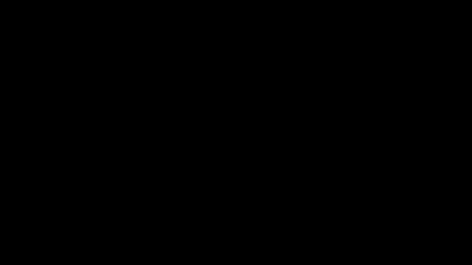

### Hibridación de orbitales hecho en Manim (versión 3/Feb/2019 - python)

<p align="center">
  
</p>

Producción audiovisual e ilustrativa de hibridación de orbitales, esta es la parte I del proyecto.
Los requisitos y la guía para instalar manim se encuentran en:  [Manim 3b1b](https://github.com/3b1b/manim)

El resultado final de esta primera parte es: 

### Fuentes de interés y agradecimientos:

Para los 3D Plots:[Theorem of Beethoven](https://github.com/Elteoremadebeethoven/AnimationsWithManim/blob/master/English/6b_plots_3D/scenes.md#programs)

Para las gráficas 2D: [Talking Physics](https://talkingphysics.wordpress.com/2018/06/22/graphing-functions-manim-series-part-7/)

Documentación: [Manim](https://manim.readthedocs.io/en/latest/)


### Módulos y librerías necesarios:
```python
		
#!/usr/bin/env python
from big_ol_pile_of_manim_imports import *
import math
```
### Escenas 
```python
class IntroErwin(Scene):

    def construct(self):
        title = TextMobject("Erwin", "Schrodinger")
        text = TexMobject(r"\Psi (r,\theta ,\phi )= ", "R(r)", "P(\\theta)", "F(\phi)")
        text_2 = TextMobject("Funcion de probabilidad")
        text_3 =TexMobject(r"\Psi^{2}")
        image = ImageMobject("note")
        title.next_to(image, UP, buff=0.3)
        title[1].set_color(GREEN)
        transform_title = TextMobject("Ecuacion de Schrodinger")
        transform_title.to_corner(UP + LEFT)
        transform_text = TexMobject(r"\Psi _{nlm}(r,\theta,\varphi)=\sqrt{(\frac{2}{na_{0}})^{3}\tfrac{(n-l-1)!}{2n(n+l)!}}e^{\frac{-\rho}{2}}\rho^{l}L_{n-l-1}^{2l+1}(\rho )Y_{lm}(\theta ,\rho)")
        text_2.next_to(transform_text,DOWN, buff=0.3)
        text_3.next_to(transform_text,DOWN,buff=1.5)
        self.play(
            Write(title),
            FadeInFrom(image, UP),
        )

        self.wait(3)

        self.play(
            LaggedStart(FadeOutAndShiftDown, image)
        )

        self.wait()

        self.play(
            Transform(title, transform_title),
            Write(text)
        )
        self.wait(2)

        self.play(
            Transform(text, transform_text),
            Write(text_2),
            ShowCreation(text_3)
        )

        self.wait(5)

        self.play(
            LaggedStart(FadeOutAndShiftDown, transform_title),
            LaggedStart(FadeOutAndShiftDown, transform_text),
            LaggedStart(FadeOutAndShiftDown, text_2),
            LaggedStart(FadeOutAndShiftDown,title),
            LaggedStart(FadeOutAndShiftDown,text),
            LaggedStart(FadeOutAndShiftDown, text_3),
        )
        self.wait(2)
```
El resultado es este: 


-


```python
class IntroEcuation(Scene):

    def construct(self):

        text = TexMobject(r"\Psi (r,\theta ,\phi )= ", "R(r)", "P(\\theta)", "F(\phi)")
        framebox1 = SurroundingRectangle(text[1], buff=.1)
        framebox2 = SurroundingRectangle(text[2], buff=.1)
        framebox3 = SurroundingRectangle(text[3], buff=.1)
        t1 = TexMobject("n")
        t2 = TexMobject("l")
        t3 = TexMobject("ml")
        t1.next_to(framebox1, UP, buff=0.1)
        t2.next_to(framebox2, UP, buff=0.1)
        t3.next_to(framebox3, UP, buff=0.1)
        text.set_color(BLUE)

        self.play(
            Write(text),
        )

        self.wait(2)

        self.play(
            ShowCreation(framebox1),
            FadeIn(t1)
        )

        self.wait(3)

        self.play(
            ReplacementTransform(framebox1.copy(), framebox2),
            ReplacementTransform(t1.copy(), t2),
        )

        self.wait(3)

        self.play(
            ReplacementTransform(framebox2.copy(), framebox3),
            ReplacementTransform(t2.copy(), t3),
        )

        self.wait(6)

        self.play(
            LaggedStart(FadeOutAndShiftDown, text),
            LaggedStart(FadeOutAndShiftDown, framebox1),
            LaggedStart(FadeOutAndShiftDown, framebox2),
            LaggedStart(FadeOutAndShiftDown, framebox3),
            LaggedStart(FadeOutAndShiftDown, t1),
            LaggedStart(FadeOutAndShiftDown, t2),
            LaggedStart(FadeOutAndShiftDown, t3),
        )
        self.wait(2)

```

El resultado es este:

-

```python
class PlotOrbitalS(ThreeDScene):

    def construct(self):
        axes = ThreeDAxes()
        text3d = TextMobject("Orbital S en el hidrogeno")

        self.add_fixed_in_frame_mobjects(text3d)  # <----- Add this
        text3d.to_corner(UL)

        sphere = ParametricSurface(
            lambda u, v: np.array([
                1.5 * np.cos(u) * np.cos(v),
                1.5 * np.cos(u) * np.sin(v),
                1.5 * np.sin(u)
            ]), v_min=0, v_max=TAU, u_min=-PI / 2, u_max=PI / 2, checkerboard_colors=[BLUE_E, BLUE_E],
            resolution=(15, 32)).scale(1)

        self.set_camera_orientation(phi=75 * DEGREES)
        self.begin_ambient_camera_rotation(rate=0.2)

        self.add(axes)
        self.play(LaggedStart(ShowCreation, sphere), ShowCreation(axes), ShowCreation(text3d))

        self.wait(10)

        self.play (LaggedStart(FadeOutAndShiftDown, sphere),
                    LaggedStart(FadeOutAndShiftDown, axes),
                    LaggedStart(FadeOutAndShiftDown, text3d)
                    )
```
El resultado es este: 

-


```python
class PlotOrbitalP(ThreeDScene):

    def construct(self):

        axes = ThreeDAxes()
        text3d = TexMobject(r"P_{x}")
        text3d_2 = TexMobject(r"P_{z}")
        dot = Dot()
        self.add(dot)
        self.add_fixed_in_frame_mobjects(text3d)
        self.add_fixed_in_frame_mobjects(text3d_2)# <----- Add this
        text3d.to_corner(UL)
        text3d_2.to_corner(UL)

        sphere = ParametricSurface(
            lambda u, v: np.array([
                1.5 * np.cos(u) * np.cos(v),
                1.5 * np.cos(u) * np.sin(v),
                1.5 * np.sin(u)
            ]), v_min=0, v_max=TAU, u_min=-PI / 2, u_max=PI / 2, checkerboard_colors=[RED_E, RED_E],
            resolution=(15, 32)).scale(1)
        sphere.next_to(dot, RIGHT,buff=-0.1)

        sphere_2 = ParametricSurface(
            lambda u, v: np.array([
                1.5 * np.cos(u) * np.cos(v),
                1.5 * np.cos(u) * np.sin(v),
                1.5 * np.sin(u)
            ]), v_min=0, v_max=TAU, u_min=-PI / 2, u_max=PI / 2, checkerboard_colors=[RED_E, RED_E],
            resolution=(15, 32)).scale(1)
        sphere_2.next_to(dot,LEFT,buff=-0.1)

        self.set_camera_orientation(phi=75 * DEGREES)
        self.begin_ambient_camera_rotation(rate=0.2)

        self.add(axes)
        self.play(LaggedStart(ShowCreation, sphere),
                  LaggedStart(ShowCreation, sphere_2),
                  ShowCreation(axes),
                  ShowCreation(text3d)
                  )

        self.wait(5)

        self.play(
            ReplacementTransform(text3d, text3d_2),
        )
        self.play(LaggedStart(FadeOutAndShiftDown, sphere),
                  LaggedStart(FadeOutAndShiftDown, sphere_2),)

        vector = np.array([0,0,1])
        vector_2 = np.array([0, 0, -1])
        sphere.move_to(dot,vector)
        sphere_2.move_to(dot,vector_2)

        self.play(LaggedStart(ShowCreation, sphere),
                  LaggedStart(ShowCreation, sphere_2),
                  )

        self.wait(5)

        self.play (LaggedStart(FadeOutAndShiftDown, sphere),
                   LaggedStart(FadeOutAndShiftDown, sphere_2),
                   LaggedStart(FadeOutAndShiftDown, dot),
                    LaggedStart(FadeOutAndShiftDown, axes),
                    LaggedStart(FadeOutAndShiftDown, text3d)
                    )


```
El resultado es este:

-

```python
class PlotWave(GraphScene):
    CONFIG = {
        "x_min": -10,
        "x_max": 10,
        "y_min": -1,
        "y_max": 1,
        "y_axis_label": " ",
        "x_axis_label": " ",
        "graph_origin": ORIGIN,
        "function_color": RED,
        "axes_color": BLACK,
        "include_ticks": False
    }
    def construct(self):

        self.setup_axes(animate=True)
        func_graph = self.get_graph(self.func_to_graph, self.function_color)
        func_graph2 = self.get_graph(self.func_to_graph2,self.function_color)

        n_1 = TexMobject(r"n = 1")
        n_1.next_to(func_graph, RIGHT + UP)
        n_2 = TexMobject(r"n = 3")
        n_2.next_to(func_graph2, RIGHT + UP)
        wave_func = TexMobject(r"\Psi _{nlm}(r,\theta,\varphi)")
        text_1 = TexMobject(r"\Psi _{nlm}(2,0,0)")
        text_2 = TexMobject(r"\Psi _{nlm}(2,1,0)")
        text_3 = TexMobject(r"\Psi _{nlm}(2,1,1)")
        image_1 = ImageMobject("HW_1")
        image_2 = ImageMobject("HW_2")
        image_3 = ImageMobject("HW_3")
        image_1.to_edge(UP,buff=4)
        image_2.next_to(image_1, LEFT, buff=1.5)
        image_3.next_to(image_1, RIGHT, buff=1.5)

        self.play(ShowCreation(func_graph2), lag_ratio=0.1)
        self.play(ShowCreation(n_1))
        self.wait(5)

        self.play(
            LaggedStart(FadeOutAndShiftDown, func_graph2),
            LaggedStart(FadeOutAndShiftDown, n_1),
        )

        self.play(ShowCreation(func_graph), ShowCreation(func_graph2), lag_ratio=0.1)
        self.play(ShowCreation(n_2))
        self.wait(5)

        self.play(
            LaggedStart(FadeOutAndShiftDown, func_graph),
            LaggedStart(FadeOutAndShiftDown, func_graph2),
            LaggedStart(FadeOutAndShiftDown, n_2),
        )
        self.wait(2)
        wave_func.to_edge(UP, buff=1.5)
        text_1.to_edge(UP, buff=1.5)
        text_2.to_edge(UP, buff=1.5)
        text_3.to_edge(UP, buff=1.5)
        self.play(
            Write(wave_func),
        )

        self.wait(2)

        self.play(
            ReplacementTransform(wave_func, text_1),
            FadeInFrom(image_1, UP),)

        self.wait(2)

        self.play(
            ReplacementTransform(text_1, text_2),
            ReplacementTransform(image_1.copy(),image_2)
        	)

        self.wait(2)

        self.play(
            ReplacementTransform(text_2, text_3),
            ReplacementTransform(image_2.copy(),image_3)
        	)

        self.wait(5)

    def func_to_graph(self, x):
        return -(np.sin(x/2))

    def func_to_graph2(self, x):
        return np.sin(x/2)

```
El resultado es este :

-

```python
class Lemniscata (ThreeDScene):

    def construct(self):

        axes = ThreeDAxes()
        text3d = TexMobject(r"P_{x}")
        text3d.to_corner(UL)

        lemniscata = ParametricFunction(
            lambda u: np.array([
                2*(np.cos(u))/(1+np.sin(u)**2),
                0,
                2*(np.sin(u)*np.cos(u))/(1+np.sin(u)**2),
            ]),color=RED,t_min=-TAU,t_max=TAU)

        self.add(axes)
        lemniscata.set_shade_in_3d(True)
        self.add_fixed_in_frame_mobjects(text3d)
        self.set_camera_orientation(phi=80 * DEGREES,theta=-60*DEGREES)
        self.begin_ambient_camera_rotation(rate=0.3)

        self.play(
            ShowCreation(axes),
            ShowCreation(lemniscata),
            ShowCreation(text3d)
        )
        self.wait(10)


```

El resultado es este:

-

```python

class MainIntro(Scene):

    def construct(self):

        title = TextMobject("ORBITALES")
        text_1 = TexMobject(r"S")
        text_2 = TexMobject(r"P")
        line = Line(ORIGIN, RIGHT * FRAME_WIDTH, buff=1)

        line.move_to(ORIGIN)
        title.next_to(line,UP)
        text_1.next_to(line,RIGHT)
        text_2.next_to(line,LEFT)
        title.set_color(YELLOW)
        text_1.set_color(GREEN)
        text_2.set_color(BLUE)

        self.play(
            ShowCreation(line),
            FadeInFromDown(title)
        )

        self.wait(5)

        self.play(
            FadeOut(line),
            FadeOut(title)
        )

        self.wait()

        text_1.to_corner(UP + LEFT,buff=2)
        text_2.to_corner(UP + RIGHT,buff=2)

        self.play(
            DrawBorderThenFill(text_1),
            DrawBorderThenFill(text_2),
        )

        self.wait(10)

```

El resultado es este:

-

```python
class Hibridation(Scene):

    def construct(self):

        title = TextMobject("HIBRIDACION")
        text_1 = TexMobject(r"SP")
        text_2 = TexMobject(r"SP^{2}")
        text_3 = TexMobject(r"SP^{3}")
        line = Line(ORIGIN, RIGHT * FRAME_WIDTH, buff=1)

        line.move_to(ORIGIN)
        title.next_to(line,UP)
        text_1.to_edge(UP,buff=2)
        text_2.next_to(text_1,RIGHT,buff=5)
        text_3.next_to(text_1,LEFT,buff =5)
        title.set_color(RED)
        text_1.set_color(GREEN)
        text_2.set_color(BLUE)
        text_3.set_color(YELLOW)

        self.play(
            ShowCreation(line),
            FadeInFromDown(title)
        )

        self.wait(3)

        self.play(
            FadeOut(line),
            FadeOut(title)
        )

        self.wait()

        self.play(
            Write(text_1),
            ReplacementTransform(text_1.copy(), text_2),
            ReplacementTransform(text_2.copy(), text_3),
        )

        self.wait(10)

```
El resultado es este: 

-

